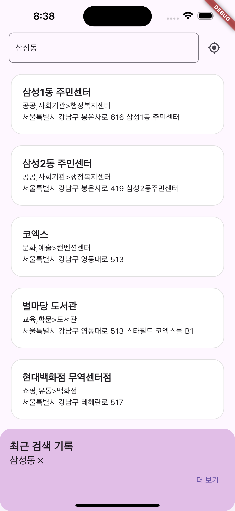

# 지역 검색 앱

    
    
    
    

- 검색어를 입력하면 관련된 지역 검색 결과가 화면에 출력됩니다.
- 검색 결과를 클릭하면 공식 홈페이지를 볼 수 있습니다.
- GPS 아이콘을 누르면 현재 위치를 추적하여 검색할 수 있습니다.
- 최근 검색 기록을 볼 수 있습니다.
- 최근 검색은 최대 3개까지 볼 수 있고 `더 보기` 버튼을 누르면 이전 기록을 모두 볼 수 있습니다.
- 검색 기록은 일부 및 전체 삭제가 가능합니다.
